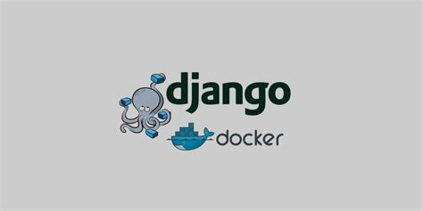

# Implemantación de modelos de ML en una API con Django Rest

  

## Resumen

### Objetivo
El principal objetivo de este projecto es la implementacion de modelos de ML en una API con django rest framework. Para esto se desarrollarán dos modelos de redes neuronales para su posterior implementación en la API.

### Prerrequisistos

* Python
* Docker
* Django Rest

## Indice

### [ARTICULO 1: Análisis exploratorio de datos(EDA).](Parte1_EDA.ipynb)

* Planteamiento del problema 
* Qué es EDA?
* Obtención de los datos
* Analisis exploratorio de datos 

### [Articulo 2: Análisis de sentimientos.](Parte2_sentiment_analysis.ipynb)

* Qué es el análisis de sentimeientos? 
* Conceptos basicos
* Preprocesamiento de datos
* Qué es un modelo BiLSTM?
* Modelo BiLSTM con keras
* Entrenamiento y evaluación 
* Descarga del modelo

### [ARTICULO 3: BiLSTM.](parte3_bilstm.ipynb)

* Planteamiento del problema 
* Qué el un modelo BiLSTM?
* Preprosesamiento de datos
* Modelo BiLSTM con pytorch
* Entrenamiento
* Evaluanción
* Descarga del modelo

### [ARTICULO 4: API](parte3_bilstm.ipynb)

* Qué es Docker? 
* Creación de un Docker container
* Qué es Django?
* Creación de un projecto y una app con Django 
* Desarrollo de la API 
* Integración de los dos modelos de ML en la API
* Qué es postman?
* Test de la API en postman
